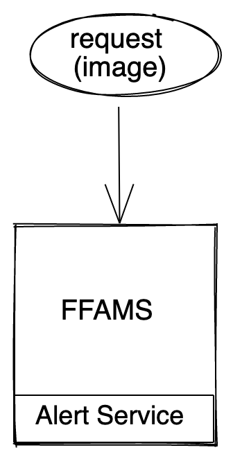
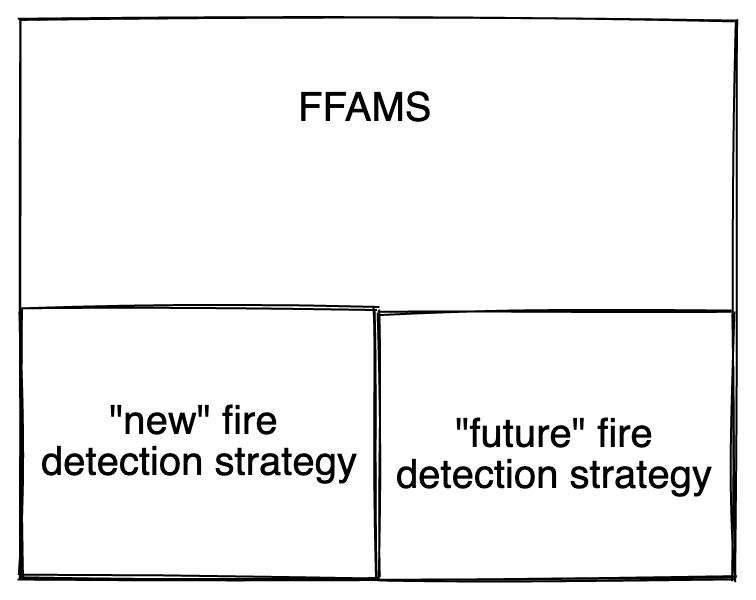
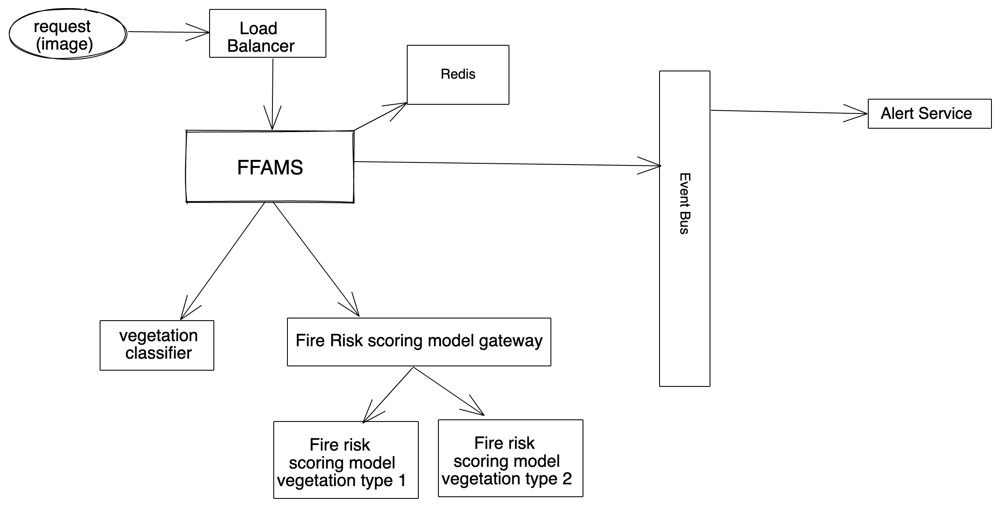

# onfido-document-FFAMS

Onfido challenge for backend developer at Document team, by Pedro Rijo (August 2020).

# Extra assumptions

## Deprecating old/current strategy

It is not 100% clear if we want to keep using the old/current fire detection system for known areas. We are thus assuming that the new ML models have been tested and have returned satisfactory results for the known areas, and thus is safe to fully replace the system. This gives us the benefit of not keeping 2 systems in parallel, and simplifies the overall architecture.

## Stateless vs Stateful Tensorflow models

Besides usual stateless ML models, Tensorflow allows us to create models which are stateful. Take as an example some Deep Learning algorithms. 

If we are talking about Random Forests for instance, we could deploy as many instances as we'd like, and use them concurrently. With Deep Learning, we open the possibility of each ML model instance evolve into a different direction. 

For now we assume that all Tensorflow models are stateless. 

Allowing stateful models would require a bit of investigation. Naive solutions would include not having redundancy or simply allowing instances to diverge. 

## Latency 

While we don't want to get an alert for a fire 3 days after it starts, we don't actually need milliseconds latency for an alert upon receiving a request/image. If we take 1 minute (as an example) to generate the alert (which is a lot of time in computation time), there shouldn't be any problem. Obviously, the faster the better, but this may allow us to have simpler solutions while evaluating trade-offs

## System usage

The system acts upon receiving aerial images from a certain area. As such, we can assume it's only going to be accessible to specific systems and not global users (normal people don't take aerial images). 

The system will probably get the images from satellites, weather balloons, or fire brigade drones.

We also assume that "fire watchers" still exist across dangerous areas. They can be useful as fallback mechanism, or to detect false positives.

The system will probably not be a world wide system, but more like regional or national system. This limits the amount of images we'll receive by the area of the country.

# Solution

As of now, we already have a solution in place, but with some restrictions that we want to overcome. In order to support fire detection in other areas, we will need to use the new machine learning models. 

Overall, upon receiving a request for fire assessment, which contains the image we 

1. start by sending the image to the vegetation classifier using the available HTTP API
2. the classifier returns the set of vegetation types found, as well as the weight of each vegetation in the image
3. we then ask each vegetation specific fire risk model the score
    *  for performance reasons all models are called in parallel
4. upon receiving all scores, we compute an overall fire likelihood score based on a ​weighted average of each model score
5. if the overall score is upon a certain threshold, we need to trigger an alert

## Architecture

We can start by identifying a few components from the problem description:

* We have the existing FFAMS application
* We have the vegetation classifier
* We have the several fire risk models

Let's also see the current architecture before looking into a solution:

### FFAMS and Alerting system

One of the things we can do is to split the FFAMS "core" logic, and the alerting system. Those two systems can be decoupled in order to get more fine-grain control over scalability in different parts of the system. 

Now we have different possibilities on how these two components communicate:

1. Directly, by having FFAMS calling some public endpoint on the Alerting system

2. Event based, by having an event bus in the system. The FFAMS would publish events and the Alerting system would be listening to those events. 

The second approach makes it easier to have different Alerting systems, each dedicated to a different channel (email, sms, population direct alerts, emergency teams dedicated protocols, etc). In this approach we make Alerting system as "dumb" as possible. It should only pick the alert and send through the proper channel. It's up to the event publisher (FFAMS) to check the alerting threshold. The advantage here is to avoid adding an event for every request that we get.

Finally, we also need to take into account alert silence. If we detect a fire in `t_0` for `area_0`, we will probably keep detecting fire in that area for a long time. Until the fire is put off, we want to avoid any more alarms. But as soon as we consider the fire is put off, we want to check if it didn't start again.

The proposed way is to add that information into a cache like Redis, so that it can be accessed efficiently by any FFAMS instance. We could instead use a persistent storage, but since data can be recomputed with small consequences, we stick to Redis for efficiency. As an extra, Redis maintenance is typically easier than persistent storage.  

This information can also be used in another way: to skip calls to scoring models. If there was a fire in a certain moment, we do not need to keep looking for fires in that area as it takes some time to put the fire off. This means that if a fire starts, the image for the same are won't introduce a lot of load in the system as everything is cached.

### FFAMS support for future strategies

Just as we are now moving from the current fire risk assessment strategy into a new one, it's expected we may move into another one in the future.

To accomplish that we propose to create an internal abstraction on the FFAMS in order to easily change between different strategies. This would be nothing more than creating a common interface (which translates into a java `interface` or ruby superclass/mixin).

### Fire Risk scoring models

As stated before, we'll have different models depending on the vegetation type. As such we suggest to have an abstraction which FFAMS can call. The idea is that we may want to add support for other vegetation types, and FFAMS code shouldn't be aware of that. FFAMS simply calls a "Fire Risk scoring model gateway", which is responsible for calling all the corresponding models and returns the list of scores.

This gateway also allows to A/B test retrained models or new ML algorithms for instance, without modifying the core logic of FFMAS.

### Final Result

Bellow we can see the overall system architecture proposed as a solution for this problem

Note that while it's not explicit in the diagram, the FFAMS, Alert Service, Classifier, Scoring Gateway, and Scoring models are all replicated.

### Alternative considerations

Since there's no state in this system, this could potentially be a good use case for a serverless architecture. 

While the vegetation classifier and the scoring models are not a good fit because they need to load the model into memory on every bootstrap, the FFAMS it's a good candidate. FFAMS acts like an orchestrator, calling the necessary APIs and triggering the alert if needed. As such it will be a simple component. And since we don't need low latency results, it may be a good opportunity for saving some money on resources.

> Note: to be honest here, I never actually had the opportunity to play with serverless

## Dependencies & Integration

Most of the communication between the components is done using REST APIs. 
Given the simplicity of the services there's no need to use something more powerful as GraphQL. 

Given the type of data, we'd start by using JSON on the requests. Protobuffers could be interesting if our data model evolved regularly over time, but since we don't expect very regular schema updates we can sacrifice the potential performance wins by using JSON which is much more widespread and supported

The only exception in the communication is between the FFAMS component and the Alert Service component. These 2 components are decoupled and use async communication through events as explained before. This allows to expand to different alerting mechanisms with less changes.

## Interfaces

The application as a whole just exposes a public operation: image upload for risk detection.

Each of the components offers a minimal set of operations as well. 

* The models and the gateway just classify/score the input. 
    * It would be a nice-to-have for models to return the area of the image which seems to be in fire / fire risk, or the fire level (simple fire vs complicated fires)
    * Besides that, white-box explanation could be relevant for rescue teams (tbh not sure if it's very applicable to image processing)
* FFAMS just receives the image. It then creates the alerting event with all the required information (position, timestamp, maybe image author - wether a specific sensor or human - so that alert teams can better understand the alert)

## Infrastructure

We believe there are several equally good solutions on this topic.

### Programming language

Starting with the programming language: taking into account the fact that every component is decoupled and exposed through REST APIs, the programming language is not a big concern. We could have FFAMS implemented in Python, Ruby, Java, Go, etc. Each of these languages has established web frameworks. The downside of Ruby and Python implementations could be regarding performance (topic to be assessed in the section bellow). Considering the codebase is already built in Django, the decision here would be to keep FFAMS as a Django app, to avoid reinventing the wheel and throw away existing knowledge in the codebase.

For the Scoring Gateway, we want to keep in mind we aim to make requests in parallel for each model for performance reasons. As such JVM languages or Go can have a slight advantage over Ruby/Python on dealing with parallelism (there may and probably have been improvements in both languages regarding concurrency and parallelism). 

### Event Bus

Regarding the event bus, RabbitMQ is a standard message-broker software that is able to scale and deal with what we expect in this system. 

An alternative would be to use Kafka if we wanted a more complex use case, otherwise we would avoid it, as we'd need more devops work to deal with the extra zookeeper requirement.

If we assume everything is deployed in a cloud provider, like AWS, in order to scale more efficiently, then Amazon SQS could be the easier solution to integrate on our system.

> Note: Never had the opportunity to compare RabbitMQ agains Amazon SQS. I've used RabbitMQ and it's easy for basic use case and allows more complex usages if needed. Not sure about SQS.

### Caching

We are choosing Redis over other possible caches because it's an easy to use and high-performing key-value in-memory storage. It has been battle-tested, it has bindings for all common programming languages, and it has a good community around. Furthermore, it's possible to expand into a redis cluster if we need non-volatile data in the future.

## Scale & Performance

One of the important aspects of the system, is that it's stateless. As such, it becomes easier to scale horizontally. 

As stated before, we assume the system serves a single country forests. 

Let's take Yellowstone National Park as a reference. The park is about 9.000 square kilometers. Most countries don't have a national forest area as big as Yellowstone, so let's take its size as a reference as well.

If we use the 100m x 100m image resolution as stated in the problem, this means we need almost 1M images to cover all the area. We shouldn't expect to have drones covering all the area at the same time. Nor dedicated satellites for each forest. So this estimation should be a very safe upper bound.

We also want to look at each image frequently to detect a starting fire quickly. We don't need to look at every second to the same area, but we don't want to wait half an hour to detect a new fire as mountain fires can spread very quickly. Let's use 5 minutes intervals.

This means we need to analyse 1M images every 5 minutes (more than 3.000 requests per second). This is a considerable load, but it's also one of the biggest national parks in the world. On the other hand, if we use France biggest forest as an example, it has 500 square kilometers, so we'd be talking about 50.000 images per 5 minutes, which means 170 requests per second. This is a much easier load to handle.

There are two obvious ways to decrease the system load and save costs:

* images with bigger resolution: if instead of a 100m x 100m image we had 1000m x 1000m images, this would decrease to around 10.000 images for Yellowstone, making 33 requests per second
* decrease image frequency: if instead of looking every 5 minutes to each area, we looked every 10 minutes, this would decrease to 1600 requests per second. Which is still a considerable amount.

More advanced optimizations could follow after monitoring the system performance and finding the bottlenecks. 

* If the bottleneck is on the number of requests, the previous strategies can be useful. 
* If the bottleneck is in the classification model, we could try to cache results using position or image comparison
* If the bottleneck is on the scoring models, we can assume scores are somehow static (even if they change every day, they will not likely change every hour), and cache the mapping between vegetation type and fire risk score.

## Reliability

The proposed solution uses standard replication and retry mechanisms to provide high availability, so 99.95% should be a doable target. 

As with any other software development decision, now it's a matter of evaluating trade-offs. 
Keeping in mind we have fallback human watchers, it may not be cost-effective to aim for higher availabilities as the software complexity and monthly costs would increase a lot. Despite that, here are two suggestions for achieving higher availability:

1. deploy instances across different data centers and regions. This ensures that if a particular data center gets a problem (maybe due to natural catastrophes). there's another set of instances in another data center to serve the requests even with higher latency. This can be achieved with active-active or active-passive DCs strategies.

2. When we talk about really high availability targets the problem starts to be in the time to fix problems, as we the SLAs don't allow much time to human intervention. In these scenarios adding efficient auto-healing mechanisms becomes mandatory.

## Redundancy

There will be connectivity problems as with any system. We expect most of the problems to be flaky, and solvable using a retry mechanism (use exponential back-off). In case the problem is due to one instance being down, we rely on replication to try the request with another replica, minimizing the change of not being able to actually process the image. 

In the catastrophic event of not being able to process the image, we take leverage of the fact the image of the same area will be resent in a short amount of time due to the nature of the application. This means that a single failure to analyse one image is not problematic: the problem starts if we fail to analyse the same location in many consequent requests

## Monitoring & Instrumentation

### Instrumentation

The first thing we want to measure are the common metrics: response time between each component, CPU and memory usage, error rate. This will give us the first idea on potential bottlenecks as our system is put live.

### Monitoring product goals

We also want to understand if our system is being useful. For that we need to remember the goal of the system: to detect and alert on forest fires.

There are two main capabilities we want to monitor:

1. Is the system able to reliably detect fires? I.e., what's the false positive and false negative rates? This is more specific to the ML models, and needs human confirmation.

2. Are we able to detect fires before human/manual detection? If everything the system does is to produce alerts for fires where a rescue team is already allocated, then it's not very useful.

3. The previous 2 metrics can also be somehow translated into the ultimate goal of lowering the average response time to fires.

## Failure Scenarios

### ML related failures

The first set of failures come from the data itself. Any ML-based system is heavily dependent of the data it gets. If training or live data are no good, then we may get a lot of unreliable fire predictions. Since this is more in the Data Science team scope, we'll not try to solve this.

### Context dependency failures

Other possible problem is that we are looking at each image independently. If we have a fire in one of the images, then it's expected a few more images nearby to also detect a fire. This could lead to an huge increase of alerting events, that could flood the event bus. If then another fire starts on another totally different area, it could take some time to be alerted even if the event is fired quickly. To solve this we would need to take 'neighbour images' into account as well before alerting. 

### Model scoring failures

Yet another potential problem already approached is that we have one of the vegetation scoring models down for some reason. In that case the weighted average can be computed without that particular vegetation score. On the other hand we may be missing a 0.99 vegetation and only scoring based on a 0.01 vegetation type. To avoid such cases we should introduce a 'weight' threshold. If we can't score enough vegetation, then an error should be returned. This can be mitigated using replication as we said, and safer deployments of model updates using A/B tests and/or canary deployments. 

### Peak load failures

While we could scale or system, we must be aware that the caller may be a bad actor as well (due to a bug or an attacker). This means that it could increase the load 10x or 100x. 

First, there's the problem the system could take some time to scale. Then there's the problem that it will increase our costs a lot if we increase 100x the number of instances. To avoid this, we can introduce some throttling mechanism. If the threshold is set, a monitoring alert would be sent and an human could decide if the increase is legit or not.

## Risks & Open Questions

The biggest unknown at this time is the expected load. Are we going to have a 24/7 stream of images? Are we just going to have an areal view every hour?

Another unknown is that we don't know how or when are requests made. Is it regularly? are they batched? is it all day? is it just during some hours of the day?

Finally, we also don't know where are we going to have a bottleneck: is it in the classifier? in the scoring model? in the alerting system? Without initial measurements of the system is hard to predict the overal. behaviour.

Far from a technical unkown, but one thing missing at this moment is the system roadmap vision. How are we thinking in improving? which kind of new features we want to add in the future?